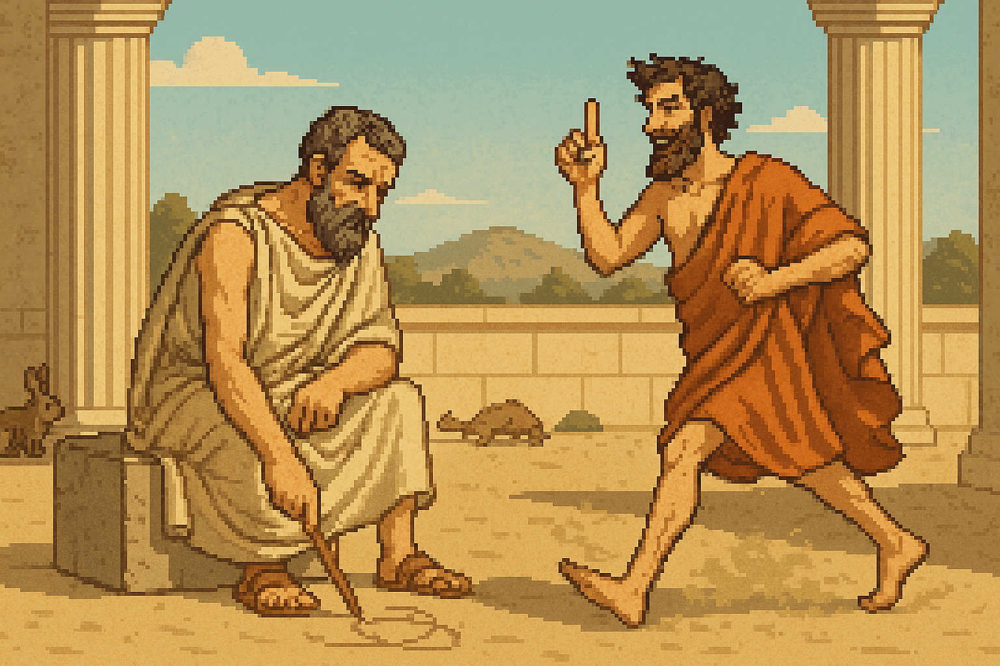
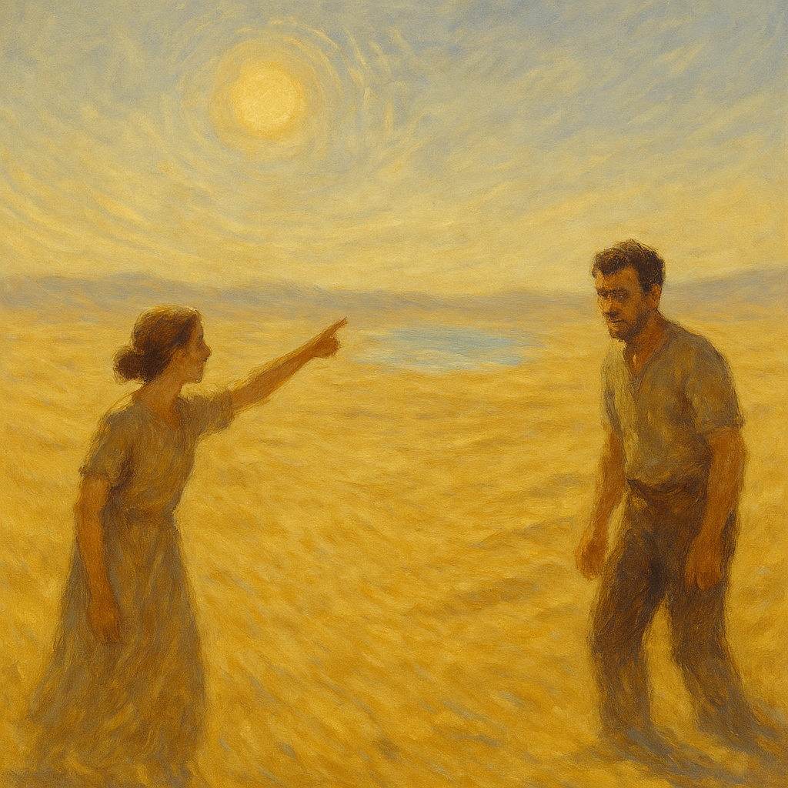
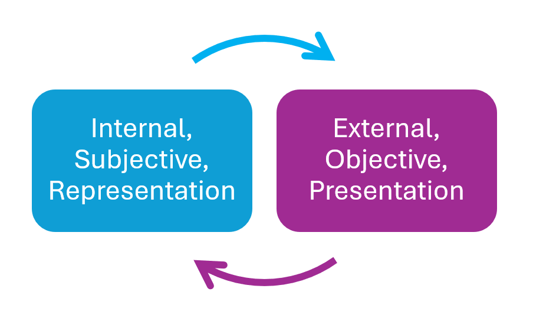

---

title: "Cryptographic Reality - pt 1"
date: "2025-05-08"
description: "An inquiry on representation and reality (Part 1): Zeno vs Diogenese, mirages and other paradoxes..."

# Optional:

fulltitle: "Cryptographic Reality - part 1"

tags: ["Cryptographic reality", "Metaphysics", "Empiricism", "Idealism", "Rationalism", "Scepticism", "Zeno", "Diogenes", "Computational theories of mind", Strange Loop, Paradox]

image: '/og/alice-bob-mirage.png'
draft: false

---

*There is a backstory to this post. The ideas explored below were first sparked by a conference on the philosophy of AI on the topic of "Representation and Reality", at a time when I was reading [Putnam's classic](https://direct.mit.edu/books/monograph/4290/Representation-and-Reality) in depth. The result is a strange mix of metaphysics, philosophy of science, computation and information theory. Happy to share these thoughts, hopefully they'll make sense to someone else.*

This is the first part of a series of posts, slowly building up to the concept of **cryptographic reality**. 

## The Path to Reality: Reason or Senses?
The nature of reality poses an intricate analytical challenge, at the root of several epistemological debates. Natural phenomena such as mirages, hallucinations and illusions point at the heart of the problem. Each of them constitute instances of an identical event simultaneously mapping to multiple contradicting interpretations, or truths. *There is something of a paradox in the quest for a scientific, objective understanding of reality, as it is arguably only accessible through the senses, or inherently subjective representations of the world.*  

Correspondingly, two opposite epistemological convictions have paved the landscape of metaphysics:

* The first one follows traditions such as *rationalism* or *sceptical idealism*. It tends to doubt the object of perception, valuing the inner experience of intuitive knowledge and absolute ideals instead.  
* The second one leans toward *empiricism* or *pragmatic materialism*. It tends to disregard our subjective interpretations, favouring the constancy of quantified experimental data.  

In more recent literature, [this longstanding tension persists under the guise of debates between *internalism* and *externalism*, across several areas of philosophical inquiry](https://plato.stanford.edu/search/search?query=internalism+externalism).

## The Reasoning Zeno vs The Sensible Diogenes: Different Argumentative Styles

**| Figure 1** _Zeno's Paradox vs Diogenes' Motion_

One of the earliest accounts of this fundamental epistemological divide can be traced back to the Antiquity. During the Hellenic Era, the Eleatic Zeno came to deny the existence of motion through four paradoxes. In the second and most famous one, Achilles enters a race against a tortoise, graciously agreeing to give the animal a head start. Although faster, Achilles must first reach the point where the tortoise began, and by then the tortoise has moved forward again. This repeats ad infinitum. [Bertrand Russell (1903)](https://en.wikipedia.org/wiki/The_Principles_of_Mathematics) elegantly stated Zeno’s counterintuitive argument as follows:  
> The slower will never be overtaken by the swifter, for the pursuer must first reach the point whence the fugitive is departed, so that the slower must always necessarily remain ahead.

Each of Zeno’s arguments exposed a case of infinite regress in our subjective representation of motion. Extended space, which he held to be infinitely indivisible, could not ground the result of our perceptions. Bertrand Russell thoroughly debunked Zeno’s conception of continuums and infinitesimals in light of modern mathematics. But there's another aspect to the paradox, beyond the technical soundness of the Eleatic argument.

[According to Georges Noel (1893)](./refs/1893-noel.pdf), for Zeno:

>motion is never perceived, but always inferred. Our idea of motion does not come from the outside, it is one of these notions which experience does not explain because **they explain experience**.  

(translated from French, bold font applied for emphasis)  

From a contemporary perspective, this passage suggests that phenomenal experience and our perception of the external world are fundamentally shaped by inner truths. Zeno, and the considerable amount of ink that continues to be shed over his ideas even after millennia, reveal the depth and complexity of the internalist programme.

It is said that Diogenes the Cynic once walked past a disciple of Zeno to refute his arguments: he believed in calling to sensible evidence against fallible reasoning. Accepting materiality as the fundamental building block of knowledge simplifies considerably proofs and deduction. 

Zeno’s thought experiments challenge basic common sense assumptions about the flow of time and the extension of space. Manipulating such ideas requires abstracting from external sensory inputs and questioning internal representations. In contrast, the empirical approach provides self-evident proofs: no need for infinitesimal mathematics to show that motion exists, one can simply *move* to make this point.

## From Mirages to Strange Loops

**| Figure 2** _Alice and Bob in the Desert_

Let us consider the much simpler case of a mirage. Alice and Bob got lost in the desert. They have been trudging under the blazing Sun for hours. Their water supplies are long gone. Alice sighs in despair. Bob is starting to fall behind. Will he stop following? Nothing but sand as far as the eye can see.

“Hurray! We’re saved!” Alice yells frantically, spotting a wavering patch of blue in the distance.

Bob wonders: is his friend starting to lose her mind from dehydration? From where he stands, there's not a single drop of water on the horizon.

This natural phenomenon is well known today: under intense sunlight, a surface such as a concrete or sand will emit so much heat that from a specific angle, it appears to shimmer like water. Alice is experiencing a mirage. Bob isn't.

Each of them have their own inner representation of an identical object and are led to clashing interpretations. From Alice’s point of view, we would see water. From Bob’s we wouldn’t. Who is to say who is right? Can we stand as an objective observer and decide Alice is experiencing a mirage, whereas Bob sees the real state of the world? Or could it be that we are biased by our knowledge of mirages, and that in this case Alice is right?

Adopting an empirical standpoint, one will quickly dismiss a problematic case here. Mirages are well known phenomena, and the real state of the external world is closer to what Bob perceives. According to this view, mirages stand as a reminder that we cannot trust internal representations as the only guide to reality. Nevertheless, this epistemic evaluation of the Alice-Bob-Mirage situation is derived from our contemporary scientific understanding of mirages as phenomenon involving optical and thermal properties.  

Thousands of years ago, before modern science, such events were still shrouded in mystery and open to various interpretations, especially for those who encountered them for the first time. Without the solid foundation of accumulated knowledge, perhaps the fact that Alice perceived water meant something deeper, even thought it wasn’t there. Today, resolving the situation between Alice and Bob seems trivial. Modern science has fully embraced Diogenes cynicism. Pragmatically, we are justified to believe in some form of objective reality where there is no water in front of them and Alice is just vulnerable to a mind trick. However, how is one to decide that was Alice saw was not part of reality? Isn’t the illusion she’s been experiencing real as well?

When we place ourselves as pragmatic, objective observers in the Alice-Bob-Mirage situation, it becomes easy to judge. Nevertheless, our scientific understanding of mirages can be argued to depend upon internal representations, insofar as science advances with formal, idealised models of natural events, translating them into the abstract language of mathematics. So what happens when we take some distance and judge the judge? Eventually, this is only pushing a bit further our access to the object itself, trapping us in an infinite regress, adopting the same thought pattern Zeno followed millennia ago. (about this point, I strongly suggest reading Douglas Hofstadter’s [Strange Loop](https://en.wikipedia.org/wiki/I_Am_a_Strange_Loop), which deals extensively about this notion of infinite regress from one side of the observation loop to another)

Untangling realities can seem rather straightforward pragmatically, when dealing with concrete, material objects, those which are physically extended in space, especially at a macroscopic level. But when it comes to deciding whether an abstract, conceptual entity, such as the shape of a circle, is real, we are bound to our subjective interpretations. Because our subjective access to reality inherently induces an observational bias, an objective interpretation of the real nature of a circle seems impossible. Considering microphysical levels (i.e. atomic or subatomic), there are no perfect circles in the material world. Nevertheless, physical laws crucially depend on the number π.

## Breaking Free From the Loop
Ultimately, arguments defending either the internalist or externalist explanatory enterprise seem doomed to circularity. To break free from the loop, we suggest working under the assumption that both positions are valid, and then tackle the ensuing contradictions.

**| Figure 3** _The Loop : A Paradoxical Access to Reality_

As a starting point, thus, it seems fair to concede a middle ground. On one hand, what is really perceived by each observer constitutes one instance subjective reality: it’s the interpretation of an object by a subject, the result of its private, inner representation of the world. On the other hand, the existence of an object independently of any observation constitutes an objective reality, which is the pure source of the signal interpreted by the observing subject. **Reality, understood as an ultimate truth underlying any physical or mental form, is to be found somewhere along the thread of interactions linking subject to object.**

Since the 20th century, artificial intelligence provides new theoretical models and experimental tools, revolutionising our comprehension of minds and machines. This additional knowledge allows a fresh outlook at the problem. The following posts will present an attempt to capture our paradoxical access to reality through the lens of informatics.

## What's next?
At this point, you may want to ask: what is **cryptographic reality**?  

Well, this was just a long and slow teasing warm-up. A bit of patience and the next post will elucidate more of the mystery! 🪄🔮