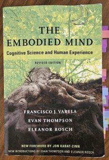
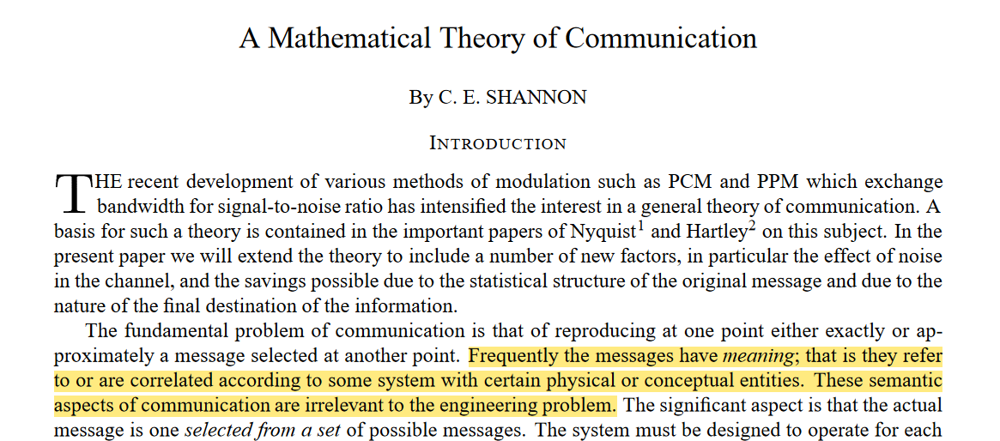

---

title: "The Embodied Mind"
date: "2025-06-02"
tags: ["reading notes"]
description: "Notes on a classic on cognitive science and human experience"
illustration: '../assets/embodied-mind-xs.jpg'
draft: true

---

# The Embodied Mind: Cognitive Science and Human Experience
### **By Francisco J. Varela, Evan Thompson and Eleanor Rosch**
**First Edition 1991, Revised Edition 2016**

This book had been on my reading list for a while and I’m glad that I could finally dive in. It is thick and dense, providing vastly detailed explanations: a tremendous amount of knowledge is compressed into these pages!  

The central idea is that we need a new scientific approach to mind: one that blends Western empirical frameworks with Eastern experiential practises. To build this case, the authors build a historical perspective of cognitive science and Buddhism. Around the second half of the 20th century, cognitivism rose from the ashes of behaviourism. This paradigm shift was largely driven by the computer revolution that brought new conceptual models and new experimental tools. In parallel, Zen traditions, yoga practise and meditation became increasingly popular in Western culture. This quasi-therapeutic adoption of oriental spiritual practises was shaped in part by the Hippie movement. The loss of belief in traditional Western religion, as announced by [Nietzsche's “God is dead"](https://1000wordphilosophy.com/2018/02/13/nietzsche-and-the-death-of-god/) and the cultural impact of globalisation are not uncorrelated.

**| Figure 1** _Front Cover of The Embodied Mind_

## A Critical Perspective of Cognitive Science

Regardless of the underlying reasons, both cognitivism and meditation have grown in popularity since the mid-20th century. Yet, the authors point out that _science_ and _experience_ seem to lead to contradicting pictures of the mind. 
The embodied mind critiques the classic computationalist trend which assumes we build an internal representation of something _“out there”_. Indeed, the idea of a [Cartesian Theatre, as famously caricatured by Daniel Dennett](https://en.wikipedia.org/wiki/Cartesian_theater), is too naïve and reductive. It is remarkably insufficient to account for the kind of experience found within meditative states. There, the self no longer clings to desires and frustrations. Concepts such as time or space slowly vanish. Ultimately, ego dissolves. If no enduring _“I”_ is _“out there”_, then scientific approaches building agentic, egocentric models fail to capture essential features of the mind.  

Cognitive science, the authors argue, must evolve to account for its shortcomings. And even in the early 90s, they anticipated a shift towards the self-organising qualities of biological systems.  

## Three Paradigms in Cognitive Science and Their Limits
The authors review three dominant paradigms of cognitive realism and how they conceptualise thinking: 

1. _**Cognitivism**_ assimilates cognition with a computer program building a representation of reality by manipulating symbols.
2. _**Emergence**_ (or *connectionism*) sees cognition as the result of neural networks activity, mathematical structures that process information statistically.
3. _**Societies of minds**_ (or *aggregates of selves*) goes beyond the individual level, focusing instead on the social aspects of cognition.

The first one fails to capture the richness of experience notably because of the rigid symbolic approach. A major issue raised by cognitivism was already acknowledged in Shannon’s seminal paper on the mathematical theory of communication (see picture below): symbolic processing relies on *syntactic operations*, but human messages generally carry *meaning*. Yet, this essential semantic dimension of information seems completely missing from the classic, old fashioned cognitivist trend. 

**| Figure 2** _Shannon's Famous Quote from 1948_

The connectionist models attempts to fix this: meaning and other advanced cognitive concepts such as intentionality (and perhaps even phenomenal experience?) simply emerge from complex, self-organised structures that capture shapes stochastically in the signals they process. Nevertheless, they leave open the question of how, out of purely statistical noise, across several different agents, a harmony gets orchestrated: where’s the maestro?

The third paradigm introduces a social lens. Drawing on thinkers like [Putnam](https://archive.org/details/representationre0000putn_r1j9), Minsky, Fodor and other early computationalists, the authors show that meaning is not always private or fixed. The word “water” might refer to H₂O here and XYZ elsewhere, but still convey similar meaning. To identify gold or distinguish elms from beeches, we often rely on experts. Our own private coherence only gains significance once shared.

Once the Cartesian Theatre picture is challenged by virtually every field of scientific inquiry, the other picture that appears reveals multiple agents, performing at various operational levels, yet coordinating through chaos and complexity to agree on the incommensurably detailed reality we share without fail. To solve this emergent phenomenon (regular patterns engendered out of chaotic interactions), it is tempting to shift away the attention from a self, to a decentralised organisation of multiple systems. Yet, a gravitational pull remains: agentivity persist, propelling us back to a single interpretative centre. The book calls this the *“I of the storm”* (see the [post on cryptographic reality for a more allegorical take at it](../blog/2025-05-08-cryptographic-reality). We’ve only begun to scratch the surface.

## The Algorithmic Limits of Cognition and Experience
On a more technical level, the book raises serious limitations about the three aforementioned paradigms as they confront what the authors call *Cartesian Anxiety*: is truth ultimately grounded in objective knowledge or the chaotic interactions between subjective perspectives? 

This tension mirrors the classic dichotomy between idealism and realism (and resonates with the [paradoxical access to reality in Cryptographic Reality pt 1](../blog/2025-05-08-cryptographic-reality)). These three paradigms also coincide with developments in AI, with some them unfolding as we speak:

* **GOFAI** (Good Old-Fashioned AI) was based on symbolic manipulation and handcrafted rules.
* **Connectionism** (artificial neural networks) corresponds to a class of algorithms fuelled by gradient descent and statistical pattern learning.
* **Social cognition** is now emerging in contemporary AI as researchers model distributed and interpersonal meaning. 

The first wave of successful AI systems, GOFAI, had to make the best use of its scarce resources, and was relying heavily on programmers ingenuity. Since the 80s though (and as the authors could witness) connectionist approaches have risen: a small gradient descent algorithm (neural networks) will allow a program, over billions of iterations and data points, to learn a reliable statistical distribution of real, almost raw information. This second approach could only really take off over the past decade thanks to enough computing power (cloud and distributed computing over many CPUs/GPUs) and enough data (internet, smartphones, mechanical Turks). 

But each has its limits.

The **GOFAI** (Good Old Fashioned AI) approach was based on symbolic information processing. A symbol stands for the thing it represent, thereby incarnating the crux of classical, internalist representationalism: through symbols, you name the _“things out there”_, building an internal representation of this external world. And, by manipulating these symbols the right way, you may _“think”_.  But this approach has many limitations. We mentioned earlier the problem of _*meaning*_ vs _*syntactic*_ operations. It is famously illustrated by [Searle's Chinese Room experiment](https://en.wikipedia.org/wiki/Chinese_room). But technically, it goes even further: **if there is such a thing as a “correct” representation of the world, how can we build it when everything keeps changing and evolving over time?**

A conception of mind where everything is fixed in advance by some lines of code seems untenable.

In contrast, **connectionism** builds on the _sub-symbolic_ level: ultimately, meaning is not tied to the subjective representation of an error prone agent who could in turn corrupt the entire network of associations. Instead, it is reliable, robust, almost interpersonal: it assumes the reality of an object independently of how a specific observer will encode it. Sub-symbolic information processing is invariant across systems. Here, you don’t assume a pregiven sets of rules about the world: you learn them, statistically, as you go. **But how could this work, if the world was not already encoded reliably, objectively?**

From a technological standpoint, neural network architectures are far more adaptable and useful than heuristic ones, but somehow they must assume an underlying objective distribution of information. Otherwise, they would only process chaotic information, unable to decipher any useful pattern. This is how, in part, we are now faced with the phenomenon of [confabulation in AI](https://journals.plos.org/digitalhealth/article?id=10.1371/journal.pdig.0000388): if you process information on a strictly statistical basis, without grounding it in an objective representation of reality, your system will start inventing facts. It will lack critical insight. Therefore, connectionism draws us back to the Cartesian Anxiety problem. Furthermore, emergence is not a miraculous notion that instantly solves the problem of sorting order out of chaos: [it is a complex concept which remains poorly understood](https://consc.net/papers/emergence.pdf).  

The third paradigm, societies of mind, exposes a hypocrisy: none of two preceding approaches, on their own, can ever solve the problem of Cartesian Anxiety. You can’t pretend you have everything figured out, when everything is figuring out itself (that’s the problem of classic cognitivism). But you can’t either pretend you learn everything on the go, because in order to do so, you must assume a static, reliable pattern will emerge from the chaotic system you’re processing statistically (that’s the problem of connectionism). In fact, what social cognition teaches us, is that thought processes seem irremediably intertwined at an interpersonal level. The way I use a word will influence how you use it, and reciprocally. Meaning and intentionality are partly constituted by a social dimension, they won’t be reduced to a rigid program, nor to an adaptive one. The social dimension is now a key area of investigation in AI (its [“dark matter”](https://www.frontiersin.org/journals/computer-science/articles/10.3389/fcomp.2022.846440/full)). But, of course, it is not enough to account for experience.  

Will the solution to Cartesian Anxiety lie somewhere in between?

## Enactive, Embodied Cognition

Here’s where _enactivism_ enters the stage. Our embodiment, down to the tiniest operational level (for instance, sub-quantum) and up to the most abstract ones (social and symbolic) connects us to other constellations of information processing centers, each incommensurable in their own way.

Science has approached cognition in different ways: by identifying subject-centric logical consistencies (classical cognitivism, GOFAI), by tracking object-centric statistical regularities (connectionism, neural networks), or by modelling cognition at a social and linguistic scale. But as we’ve seen, none of these approaches are fully satisfactory on their own.

Enactivism offers a shift in perspective. It proposes that cognition arises from the dynamic interplay of body, environment, and social world. Experience is not constructed inside us nor merely received from outside, but co-shaped in the act of living. We don’t need to choose between a grounded or groundless reality: both co-exist, breathing together, informing one another in a complex web of interdependent processes. This aligns with the Buddhist notion of _[Pratītyasamutpāda](https://en.wikipedia.org/wiki/Prat%C4%ABtyasamutp%C4%81da)_ or **_dependent co-arising_**.

The enactivist position, with respect to Cartesian Anxiety, invites us to question the premise of a fixed self. The proposed solution is that _“I”_ is a fluid process, enacted through embodied engagement with the world. Much like Buddhism focuses on pre-conceptual awareness, or mindfulness, enactivism emphasises the immediacy of experience. It is not a representation, not the output of a neural net, not a product of social convention. Enactivism shifts the explanation to embodied action and perception in real time.

These ideas draw on previous works by Francisco Varela and Humberto Maturana (mainly from [this book](https://en.wikipedia.org/wiki/Autopoiesis_and_Cognition%3A_The_Realization_of_the_Living) and [this one](https://search.worldcat.org/title/24668881)) where they introduce the key notion of _autopoiesis_ according to which a (living or cognitive) system has a self-referring domain of interactions that preserves its identity. By doing so, it also preserves a history of interactions. Under this view, biological organisms form a large network of historical transformations, one that is conditioned by the _structural coupling_ between the living system and its environment.

This suggests an alternative understanding of evolution, where species undergo _natural drift_ (autopoietic optimisation) rather than selection (adaptation to environment). In _The Embodied Mind_, these principles are also extended to psychology through the Buddhist concept of Karma. Far from the vernacular usage of the term where it relates fate, in Buddhist tradition, karma relates to a circular form of psychological causality: how one experiential state leads to another, [all interconnected in the shape of a wheel](https://en.wikipedia.org/wiki/Bhavacakra). Yet, these causal chains are not irremediable: advanced states of mindfulness can break them. Therefore, this concept of karma isn't about determinism but conditionning: it highlights regular patterns in the structural paths of experience.

Altogether, the framework they expose is extremely rich, deep and thought-provoking.

Of course, this leaves open **many** questions. At the very least, pressing ones I see are Chalmer’s hard problem of consciousness, as well as the very notion of emergence. This invites further thoughts, but I’ll reserve them for later, as I feel it will overlap with the Cryptographic Reality series. More to come on the matter!  

I will also have further notes to share on this major book: on symbols and Turing Machines, ethics, Descartes, and of course on Eastern philosophy. But this post is already long enough as it is, so I’ll stop here for now.

In the meantime, if you haven’t read _The Embodied Mind_ yet, I hope you will, and I’d love to hear your thoughts when you do!
