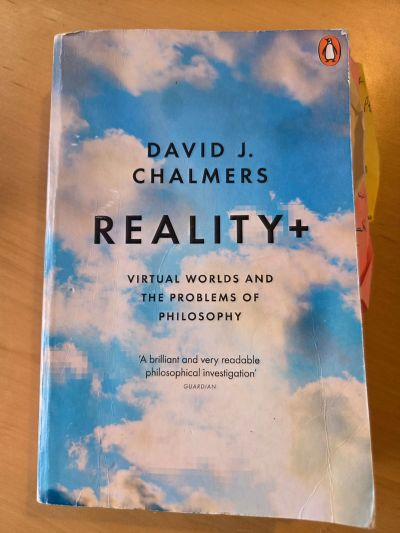
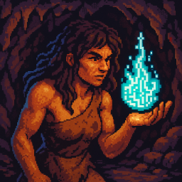
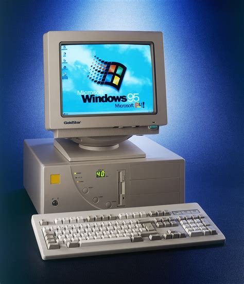

---

title: "Infosphere, Hyperhistory and the Gorniak Hypothesis"
date: "2025-11-19"
tags: ["Global Ethics", "blog"]
description: "In the information-universe, artificial agents propel us in a new era, with global ethics."
image: '/og/cavewoman-digital-flame-s.png'
draft: false

---

## A Universe of Information

The concept of **infosphere** relates to the idea that the whole of reality ultimately boils down to information. In Reality+, David Chalmers considers a few alternative metaphysical scenarios around a universe made of information:

**| Figure 1** _Front Cover of Reality+_

* **“It from bit”:** every “it” (physical particles and their properties) derives from binary structures, and therefore bits. This now classic term was originally coined by J.A. Wheeler in “Information, Physics, Quantum: The Search for Links” (1989).
* **“It-from-bit-from-it”:** the universe is made of digital bits (classic “it-from-bit”), and further assumes an underlayer of physicality (e.g. although this universe might be a digital simulation, it _must_ be running on a physical computer somewhere).
* **“Pure It-from-bit”:** the most fundamental level on which all of physical reality is built is grounded in mathematics.

The infosphere isn’t necessarily restricted to digital or syntactic bits. In the present context, information is best understood à la Bateson-Chalmers: _“information is any difference that makes a difference”_. This includes differences in meaning, in qualities, in experiences. The infosphere includes _all there is_.

**Why would we need a new word for reality?**

Relating to reality as infosphere stands as an acknowledgement that **_any event, as it unfolds, is writing bits of the story of the universe_**. The notion of information, with its ambivalent relation to computation, shakes pre-digital era concepts. Seeing reality as a natural pool of information has generated a myriad of new insights since the 2nd half of the 20th century.

In “How the Infosphere is Reshaping Reality”, Luciano Floridi compellingly crystalises an thought that had been whispered in the hallways of both science and philosophy for a while, an echo that was only getting louder: **_The increasing complexity of information processes is a salient marker of universal evolution_**.

This idea is far from new. It's been notably illustrated by [Conway's game of life](https://en.wikipedia.org/wiki/Conway's_Game_of_Life). The novel insight in Floridi's framework is that humankind is currently stepping out of History, into a new era, ushered by artificial information processing systems and agents: _Hyperhistory_.

## Human History Through the Lens of Information

In prehistory, information among humans was mostly communicated orally and couldn’t persist through time or generations. Long before the first written scripts, some proto-symbols already persisted across generations: buildings, tools and rituals carried meaning within sedentary communities, making agriculture and metallurgy possible. The passage to History occurred when we developed external codified symbolic systems to share meaning across individuals and through time: _writing_.

Through writing, information persists more reliably: early calendars and clockwork allowed the recording of timestamps which could be compared across regions and generations. This ushered a new era, where mythology slowly evolved in dogmatic, book-based religions.

Then came the printing press which significantly accelerated the transmission of information. We no longer needed human labour to single-handedly record each symbol. A few humans could operate a machine that would make the work go multiple times faster than a dozen scribes. Mechanically, with Gutenberg, the scientific revolution reached full bloom; the Enlightenment rose and the ambition of an Encyclopaedia with it. With the automation of printing symbols, the job of scribes disappeared. Paradoxically, it democratized access to the knowledge that made them special: reading and writing. We could all be scribes now, but we have more complex information patterns to process.

The advent of artificial information recording systems marked the start of History: information could now persist through technology, enabling us to delegate part of our memory (facts and procedures) to artefacts. Hyperhistory begins with the appearance of new agents in the infosphere: artificial information systems able to (quasi-?)meaningfully process data with us, furthering the [extension of conscious minds](https://en.wikipedia.org/wiki/Extended_mind_thesis).

This technological revolution displays an exponential curve: new tools are being developed at an unprecedented pace and scale. Some believe that humanity’s evolution will rise just as steeply. I disagree. [I strongly believe](https://transhumanistes.com/lhumanite-est-a-laube-dune-transformation-profonde-et-durable-entretien-avec-aida-elamrani-astound/) that humanity is currently at the dawn of a profound and lasting transformation, yes. However, this change will not occur suddenly, over a few decades. Our capacity to adapt (as individual or societies) remains constrained by time and ressources, and it cannot absorb instantly the full potential of this technology. This new chapter will unfold over multiple generations to come.

## Prehyperhistoric Humans

During this transition period, we are in many ways like _prehistoric humans_ acquiring the mastery of fire: slowly evolving out of old ways, and stepping into new modes of living.  

Within the concept of infosphere, prehistoric fire is also an information technology: it conveyed signals, reshaped affordances, and enabled new practices by transforming gathering places, expression, norms, and tools. Fire was an essential computational/linguistic symbol (both logical and allegorical) in the history of metallurgy, persistent writing, and overall technological progress. (More detailed accounts of this fascinating trajectory can be found [here](https://en.wikipedia.org/wiki/Catching_Fire%3A_How_Cooking_Made_Us_Human), [here](https://search.worldcat.org/title/493115117))

**| Figure 2** _A Prehistoric Woman Holding a Digital Flame (generated with ChatGPT)_

Although technology is advancing fast, current widespread usages such as social media, instant messaging, or digital assistants will ultimately be seen as archaic, early and clumsy adoptions of artificial information processing systems in the greater Hyperhistoric era. Taming this new power will require a several iterations of trials and errors. It’s simply too early to imagine, even in fiction, the mature stage of this new era in humankind.

How far will this artificial fire take us? Computation (AI) is finally taking off, but we can already foresee more transformative innovations in the near future, including V/XR, robotics and new computing devices (quantum, bio-chemical, etc…).

Meanwhile, another, more immediate story is unfolding before our eyes as a result of new information technologies. 

## The Gorniak Hypothesis

In the 90s, the personal computer gained in popularity, and the internet progressively spread throughout the world. It was in this context that the philosopher [Krystyna Gorniak-Kocikowska proposed the following hypothesis](https://doi.org/10.1007/BF02583552):

1. Technological revolutions generate revolutions in our ethical codes.
2. The information revolution, with the interconnectivity of data on the network, has a global reach.
3. (1+2) Consequently, the new ethical codes of this revolution also have a global reach. **The information revolution will be the first technological revolution to lead us to define a global ethic**: one that addresses the totality of human relationships and actions.

While our interfaces with artificial information processing systems are unstable and will keep evolving fast, a lasting and more fundamental change is already in effect, as the Gorniak Hypothesis was predicting. We have reached the technological stage of global intercommunication. Humanity naturally aspires to share information. Now, we are instantly connected globally. The cyber web has strengthened and developed the social tissue at a global scale, creating new ways to aggregate in borderless communities; radically transforming cultural, financial and political dynamics – _for good, or bad_.

With our actions and discussions embedded at a global scale, this technology is already enabling **_moral_** progress.

## Immediate History

This new technological revolution provides unprecedented means of both oppression and liberation.

The vast majority of us has _always_ wanted global peace and freedom. Meanwhile, a few entitled egotists have consistently priviledged their individual benefit at the detriment of anybody else: either by sending others to slaughter like docile blood-sport beasts, or by forcing them to compete cruelly over resources and opportunities. Times are changing: these abuses can now be witnessed and denounced collectively, on a global scale, through the instant reach of the information web.

As an active optimist, I chose to believe that Hyperhistory will end damaging, old-fashioned ways of drawing artificial frontiers, and, of following perverse leadership. Information technologies can be leveraged to administrate resources and efforts, _fairly_ and _globally_. To empower humanity with **_tolerance_** and trust, through decentralised structures and processes.

I do not mean to downplay the challenge of computing fairness: there’s no satisfactory equation for that. Not all problems can be solved, and no situation is ever permanent. That’s why we will always need to engage in continuous discussions, globally and locally. Utopias are vain, but dreams and hopes can guide systemic improvements. 

Artificial information processes can support such a transition toward a more _intelligent_ world order: more nuanced, adaptive and inclusive, based on _solidarity_ and _team-spirit_. Faced with many global challenges, our best bet is to advance collaboratively rather than through competition.

Hopefully, global sustainability is the moral challenge that will shape and guide the hyperhistorical transformation. One priority towards this end is naturally education: _empowering each of us to shape equally our shared future_. 

With this new technological power comes the duty to uphold universal rights, and to extend them beyond human sovereignty.